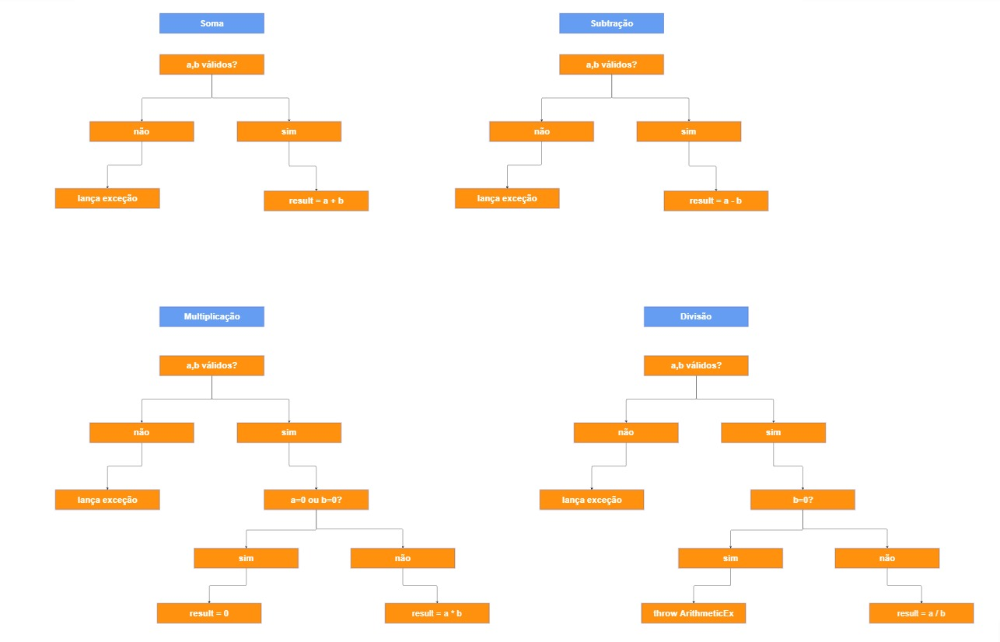

# Grupo: JUnit 5 Framework

**Integrantes:**
- Gabriel Ramos
- João Pedro Braga
- João Vitor Romero  
- Lucas Randazzo
- Lúcio Neto

---

## 1. Descrição do Framework Selecionado

O **JUnit** é o framework de teste mais popular para a linguagem Java. Sua versão atual, jUnit 5, representa uma evolução significativa em relação ao JUnit 4. Ele foi atualizado para suportar os novos recursos do Java e as práticas modernas de desenvolvimento, agora apresenta uma estrutura composta por três subprojetos principais:

- **JUnit Platform**: Serve como base para execução de testes em diferentes ferramentas
- **JUnit Jupiter**: Nova API de programação e extensão para escrever testes na versão 5 do framework
- **JUnit Vintage**: Suporte para execução de testes JUnit 3 e 4

Principais características:
- Suporte a lambdas e programação funcional
- Anotações mais expressivas e flexíveis
- Modelo de extensão mais poderoso
- Melhor suporte para testes parametrizados
- Compatibilidade com IDEs modernas e ferramentas de build

---

## 2. Categorização do Framework

### i) Técnicas de Teste
O JUnit 5 suporta múltiplas técnicas de teste:
- **Teste de Unidade**: Foco principal do framework
- **Teste Funcional**: Através de testes baseados em comportamento
- **Teste Baseado em Estados**: Verificação de mudanças de estado do objeto
- **Teste Parametrizado**: Múltiplas entradas para o mesmo teste

### ii) Níveis de Teste
- **Teste de Unidade**: Nível primário de aplicação
- **Teste de Integração**: Através de extensões e testes com dependências
- **Teste de Sistema**: Quando combinado com outras ferramentas do ecossistema

### iii) Tipos de Teste
- **Teste Estrutural (Caixa Branca)**: Conhecimento interno da implementação
- **Teste Funcional (Caixa Preta)**: Baseado na especificação do software (no caso do nosso grupo, a calculadora)
- **Teste de Regressão**: Garantia que novas modificações não quebram funcionalidades existentes

---

## 3. Forma de Instalação/Integração

### Em um projeto maven, insira a dependência abaixo:
```xml
<dependency>
    <groupId>org.junit.jupiter</groupId>
    <artifactId>junit-jupiter</artifactId>
    <version>5.9.2</version>
    <scope>test</scope>
</dependency>
```

---

## 4. Estratégia de Teste para Derivação de Casos de Teste

### Técnicas Utilizadas

#### **4.1 Particionamento de Equivalência**
Dividimos o domínio de entrada em partições onde elementos da mesma classe revelam os mesmos defeitos:

**Operação de Divisão:**
**Partições de Equivalência:**
- C1 – Denominador ≠ 0 → divisão válida
- C2 – Denominador = 0 → exceção esperada
- C3 – Numerador = 0 → caso especial (resultado = 0)

**Valores de Fronteira:**
| Partição | Limite Inferior | Limite Superior | Exemplos de Teste |
|-----------|-----------------|-----------------|-------------------|
| C1 (Denominador ≠ 0) | b = ±1 (vizinhos do zero) | b = 2.147.483.647 | divisao(10, 1), divisao(10, -1), divisao(1, Integer.MAX_VALUE) |
| C2 (Denominador = 0) | b = 0 | b = 0 | divisao(10, 0), divisao(-5, 0) |
| C3 (Numerador = 0) | a = 0 | a = 0 | divisao(0, 1), divisao(0, -5) |

Observações:
- O **denominador = 0** é o limite crítico da partição inválida (gera exceção).
- **Denominadores ±1** são limites imediatos da zona inválida (valores válidos mínimos).
- O **numerador = 0** testa o caso de borda onde o resultado deve ser exatamente 0.


**Partição Válida**: Denominador ≠ 0 → `divisao(10, 2)`
**Partição Inválida**: Denominador = 0 → `divisao(10, 0)` → Exceção esperada
**Caso Especial**: Numerador = 0 → `divisao(0, 5)`

**Operação de Soma:**
**Partições de Equivalência:**
- C1 – Ambos positivos
- C2 – Ambos negativos
- C3 – Mistos (um positivo, outro negativo)

**Valores de Fronteira:**
| Partição | Limite Inferior | Limite Superior | Exemplos de Teste |
|-----------|-----------------|-----------------|-------------------|
| C1 (Positivos) | 0 e 1 | 2.147.483.647 | soma(0, 1), soma(1, 1), soma(Integer.MAX_VALUE, 1) |
| C2 (Negativos) | -2.147.483.648 | -1 e 0 |  soma(-1, -1), soma(-1, 0), soma(Integer.MIN_VALUE, -1) |
| C3 (Mista) | -2.147.483.648 | 2.147.483.647 | soma(-1, 1), soma(1, -1), soma(0, -1) |

Observações:
- O **valor 0** é o limite entre números negativos e positivos.
- Os **limites do tipo Integer.MIN_VALUE e Integer.MAX_VALUE** testam o comportamento em overflow.


- **Partição Positivos**: `soma(5, 3)`
- **Partição Negativos**: `soma(-2, -3)`
- **Partição Mista**: `soma(5, -3)`

#### **4.2 Análise do Valor Limite**
Testamos valores nos limites das partições, onde defeitos são mais prováveis:

**Valores Críticos para Divisão:**
- Próximo de zero: `divisao(1, Integer.MAX_VALUE)`
- Zero exato: `divisao(10, 0)` → Exceção
- Precisão decimal: `divisao(0.6, 0.2)`

#### **4.3 Grafo de causa e efeito**



---

### Casos de Teste Implementados

| Operação | Caso de Teste | Técnicas Aplicadas | Causas no Grafo | Efeitos Esperados | Valores de Entrada | Código de Teste |
|----------|---------------|-------------------|-----------------|------------------|-------------------|----------------|
| **Soma** | Soma inteiros positivos | Grafo + Particionamento | a,b válidos | resultado = a + b | (10, 5) | `soma(10, 5)` → 15 |
| **Soma** | Soma inteiros negativos | Grafo + Particionamento | a,b válidos | resultado = a + b | (-2, -3) | `soma(-2, -3)` → -5 |
| **Soma** | Soma positivo + negativo | Grafo + Particionamento | a,b válidos | resultado = a + b | (5, -3) | `soma(5, -3)` → 2 |
| **Soma** | Soma valores double | Grafo + Valor Limite | a,b válidos (double) | resultado = a + b | (2.5, 2.0) | `soma(2.5, 2.0)` → 4.5 |
| **Multiplicação** | Multiplicação básica | Grafo + Particionamento | a,b válidos | resultado = a × b | (4, 5) | `mult(4, 5)` → 20 |
| **Multiplicação** | Multiplicação por zero | Grafo + Valor Limite | a=0 ou b=0 | resultado = 0 | (10, 0) | `mult(10, 0)` → 0 |
| **Subtração** | Subtração básica | Grafo + Particionamento | a,b válidos | resultado = a - b | (10, 7) | `sub(10, 7)` → 3 |
| **Divisão** | Divisão inteira normal | Grafo + Particionamento | a,b válidos, b≠0 | resultado = a ÷ b | (10, 5) | `div(10, 5)` → 2 |
| **Divisão** | Divisão por zero (int) | Grafo + Valor Limite | b=0 | ArithmeticException | (10, 0) | `div(10, 0)` → Exception |
| **Divisão** | Divisão double normal | Grafo + Particionamento | a,b válidos (double), b≠0 | resultado = a ÷ b | (5.0, 2.0) | `div(5.0, 2.0)` → 2.5 |
| **Divisão** | Divisão por zero (double) | Grafo + Valor Limite | b=0.0 | ArithmeticException | (5.0, 0.0) | `div(5.0, 0.0)` → Exception |
| **Soma** | Soma parametrizada | Grafo + Particionamento | múltiplas combinações | vários resultados | (1,1), (0,0), (-1,-1) | `@ParameterizedTest` |
| **Valores Extremos** | Soma limites int | Grafo + Valor Limite | a,b extremos | resultado cálculo | (MAX_VALUE, MIN_VALUE) | `soma(MAX, MIN)` → -1 |

### Exemplo de Mapeamento para Código

```java
// Particionamento de Equivalência - Partição Inválida
@Test
void testDivisaoPorZero() {
    assertThrows(ArithmeticException.class, () -> {
        Calculadora.divisao(10, 0);
    });
}

// Análise do Valor Limite - Precisão Decimal  
@Test
void testDivisaoDecimalPrecisao() {
    assertEquals(3, Calculadora.divisao(0.6, 0.2));
}
```
